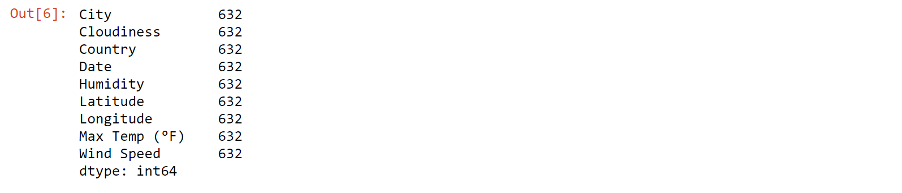
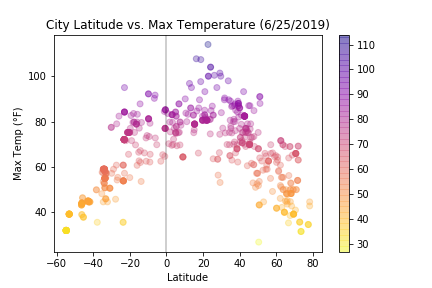
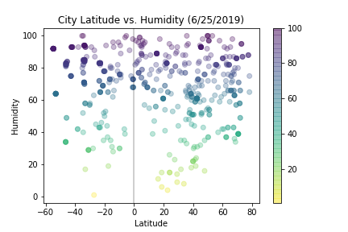
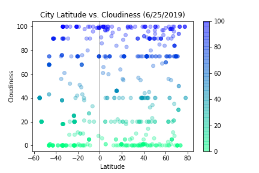
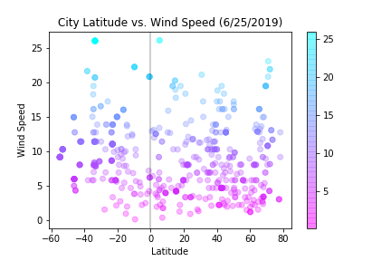

# Open Weather Map API Challenge

Visualization of weather changes approaching the equator using random coordinates of over 600 cities around the world


## Analysis

1. The Latitude vs Temperature Plot clearly shows temperatures rise as you get closer to the equator. 
2. Temperatures rising as you get closer to the equator does not mean that the cities along the equator are the hottest. In fact, the hottest cities are just north of the equator.
3. There is no trend between distance from equator and humidity, cloudiness, or wind speed.


#### Dependencies and Setup

```python
# Dependencies and Setup
import matplotlib.pyplot as plt
import matplotlib.cm as cm
import pandas as pd
import numpy as np
import requests
import time
from datetime import datetime as dt
import openweathermapy as owm
from config import api_key
from citipy import citipy
```

#### Generate Random Cities

```python
# Create empty lists
lats = []
longs = []
coords = []
cities = []

# stop random from resetting
# np.random.seed(125)

# get latitudes and longitudes
for lat in np.random.randint(-90,90,700):
    lats.append(lat)
for long in np.random.randint(-180,180,700):
    longs.append(long)

# zip together
coords = zip(lats, longs)

# Identify nearest city for each coordinate and append the city_name/country_code to 
for lat,long in coords:
    city = citipy.nearest_city(lat,long)
    if city not in cities:
        cities.append(city.city_name)

# Print the city count to confirm sufficient count
print(f"You have generated {len(cities)} cities.")
```
You have generated 700 cities.


#### Perform API Calls

```python
# make lists for data to be put into
city_name = []
cloudiness = []
country = []
date = []
humidity = []
lat = []
long = []
max_temp = []
wind_speed = []

# count of records
record = 1

# basic url with api_key and proper units
url = "http://api.openweathermap.org/data/2.5/weather?appid=" + api_key + "&units=Imperial&q="
```

```python
# Process print log
print("Beginning Data Retrieval\n" + "-"*30)

for each_city in cities:
    try:
        owm_response = requests.get(url+each_city).json()
        city_record = owm_response["name"]
        print(f"Processing Record {record} | {city_record}")
        city_name.append(owm_response["name"])
        cloudiness.append(owm_response["clouds"]["all"])
        country.append(owm_response["sys"]["country"])
        date.append(owm_response["dt"])
        humidity.append(owm_response["main"]["humidity"])
        lat.append(owm_response["coord"]["lat"])
        long.append(owm_response["coord"]["lon"])
        max_temp.append(owm_response["main"]["temp_max"])
        wind_speed.append(owm_response["wind"]["speed"])
    
        record += 1
        time.sleep(1.01)
        
    except Exception as e:
        print("City not found. Skipping...")
        
print("-"*30 + "\nData Retrieval Complete\n" + "-"*30)
```

Beginning Data Retrieval
______________________________
Processing Record 1 | Cape Town
Processing Record 2 | Yarensk
Processing Record 3 | Rikitea
Processing Record 4 | Rikitea
Processing Record 5 | Bereda
Processing Record 6 | Vaini
Processing Record 7 | Hilo
Processing Record 8 | Leeton
Processing Record 9 | Gao
Processing Record 10 | Maragogi
...
Processing Record 625 | Khatanga
Processing Record 626 | Butaritari
Processing Record 627 | Nanortalik
City not found. Skipping...
Processing Record 628 | Lebu
Processing Record 629 | Avarua
Processing Record 630 | Cayenne
Processing Record 631 | Punta Arenas
Processing Record 632 | Rawlins
______________________________
Data Retrieval Complete
______________________________


#### Make Data Frame, Display, and Export

```python
# Create empty data frame to fill in after API calls
df = pd.DataFrame({"City": city_name, "Cloudiness": cloudiness, "Country": country, "Date": date, "Humidity": humidity,
                   "Latitude": lat, "Longitude": long, "Max Temp (\u00b0F)": max_temp, "Wind Speed": wind_speed})
df.head()
```


```python
# Display county summary
df.count()
```




```python
# Output to CSV
df.to_csv("cities.csv", encoding='utf-8', index=False)
```


## Plotting

Four plots analyzing relationships between latitude and the following:
* Temperature in degrees Fahrenheit
* Percentage of Humidity
* Percentage of Cloudiness
* Wind Speed in Miles per Hour


#### Latitude vs. Temperature Plot

```python
# format today's date
today = f"{dt.now().date().month}/{dt.now().date().day}/{dt.now().date().year}"

# temperature plot
x_temp = df["Latitude"]
y_temp = df["Max Temp (\u00b0F)"]
plt.scatter(x_temp, y_temp, c=y_temp, alpha=0.3, cmap=cm.plasma.reversed())
plt.colorbar()
plt.axvline(0, color="black", alpha=0.25)
plt.xlabel("Latitude")
plt.ylabel("Max Temp (\u00b0F)")
plt.title(f"City Latitude vs. Max Temperature ({today})")
plt.savefig("lat-temp-scatter.png")
plt.show()
```




#### Latitude vs. Humidity Plot

```python
# humidity plot
x_humid = df["Latitude"]
y_humid = df["Humidity"]
plt.scatter(x_humid, y_humid, c=y_humid, alpha=0.3, cmap=cm.viridis.reversed())
plt.colorbar()
plt.axvline(0, color="black", alpha=0.25)
plt.xlabel("Latitude")
plt.ylabel("Humidity")
plt.title(f"City Latitude vs. Humidity ({today})")
plt.savefig("lat-humidity-scatter.png")
plt.show()
```




#### Latitude vs. Cloudiness Plot

```python
# cloudiness plot
x_cloud = df["Latitude"]
y_cloud = df["Cloudiness"]
plt.scatter(x_cloud, y_cloud, c=y_cloud, alpha=0.3, cmap=cm.winter.reversed())
plt.colorbar()
plt.axvline(0, color="black", alpha=0.25)
plt.xlabel("Latitude")
plt.ylabel("Cloudiness")
plt.title(f"City Latitude vs. Cloudiness ({today})")
plt.savefig("lat-cloudiness-scatter.png")
plt.show()
```




#### Latitude vs. Wind Speed Plot

```python
# wind speed plot
x_wind = df["Latitude"]
y_wind = df["Wind Speed"]
plt.scatter(x_wind, y_wind, c=y_wind, alpha=0.3, cmap=cm.cool.reversed())
plt.colorbar()
plt.axvline(0, color="black", alpha=0.25)
plt.xlabel("Latitude")
plt.ylabel("Wind Speed")
plt.title(f"City Latitude vs. Wind Speed ({today})")
plt.savefig("lat-windspeed-scatter.png")
plt.show()
```




## Notes

When completing this project, I couldn't get the API requests to go through. After countless tries and much googling, I separated the initial set up for the API calls including the url. I put those in a separate cell before. After that, the API calls always worked perfectly.